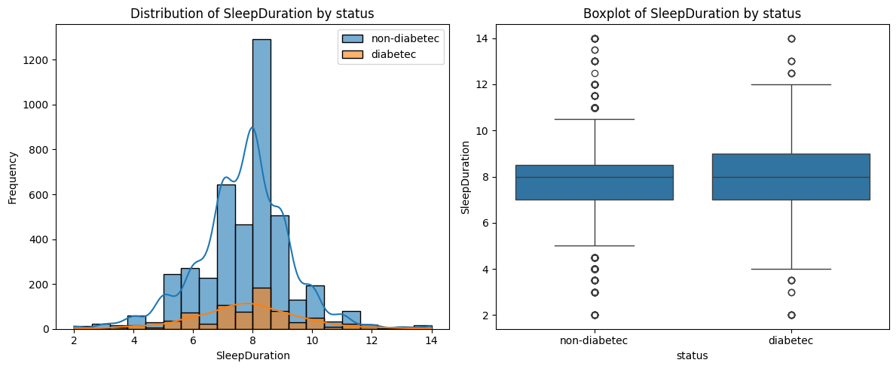

# Societal Challenges Datathon

Welcome to the **Societal Challenges Datathon** project. This repository contains code, notebooks, and utilities developed to analyze and predict health-related outcomes from the NHANES dataset. Our goal is to leverage statistical and machine learning techniques to gain insights into societal health challenges.

## Table of Contents
- [Project Overview](#project-overview)
- [Data Files](#data-files)
- [Data and Results Locations](#data-and-results-locations)
- [Notebooks](#notebooks)
- [Installation](#installation)
- [Usage](#usage)
- [Contributing](#contributing)
- [License](#license)


## Data and Results Locations

- The **test/train data** is located in the **data/** folder.
- The **ROC curves** for the trained models can be found in the **img/** folder.

## Project Overview
This project focuses on:
- **Data Analysis and Visualization:** Exploratory Data Analysis (EDA) of various health metrics.
- **Machine Learning Predictions:** Building predictive models using classifiers like Logistic Regression, RandomForest, GradientBoosting, and Adaboost.
- **Model Evaluation:** Bootstrap analysis, ROC curves, and performance metrics.

Notebooks such as `EDA.ipynb` and `prediction.ipynb` contain detailed code with visualizations and model evaluations.

## Data Files
Data files are managed by the `bootstrap.py` script which downloads, converts, and merges NHANES data into CSV files. The data used includes demographic, lab, and lifestyle information.

## Notebooks
- **EDA.ipynb:** Performs exploratory data analysis, visualizing distributions and relationships among features.
- **prediction.ipynb:** Contains functions and scripts to build and evaluate classification models.

## Installation

1. **Clone the Repository:**
    ```
    git clone https://github.com/your_username/Societal-Challaenges-Datathon.git
    cd Societal-Challaenges-Datathon
    ```

2. **Setup Virtual Environment and Install Dependencies:**
    ```
    python3 -m venv .venv
    source .venv/bin/activate
    pip install -r requirements.txt
    ```

3. **Data Preparation:**
    Ensure that data files are either available locally or download via the provided scripts.
    ```
    python bootstrap.py
    ```

    ## Visual Results

    Below are some representative images generated during model evaluation:

    

    ## Additional Visualizations

    Explore more insights with these images generated during data analysis:

    - **Age vs Diabetes:** Examining the correlation between age and diabetes prevalence.  
        

    - **Bootstrap ROC Confidence:** Visualizing bootstrap confidence intervals for ROC metrics.  
        


    - **Occupation vs Diabetes:** Analysis of diabetes incidence across various occupations.  
        

    - **Race vs Diabetes:** Insights into diabetes variation among different races.  
        

    - **Sleep vs Diabetes:** Investigating the impact of sleep patterns on diabetes.  
        

    - **Thyroid vs Diabetes:** Exploring the relationship between thyroid conditions and diabetes outcomes.  
        

    Additional visuals can be found in the img folder to help illustrate performance and key findings in the dataset.


## Usage
## Downloading and Merging NHANES Data

You can download raw datasets directly from the [NHANES website](https://www.cdc.gov/nchs/nhanes/index.htm) and merge them to create a comprehensive dataset for both training and testing. The provided scripts help automate this process:


    # Run the script to fetch the data from NHANES and merge the datasets.

    python bootstrap.py

    


- **Exploratory Data Analysis:**
  Open `EDA.ipynb` with a Jupyter Notebook to perform and view detailed analyses.
  
- **Model Training and Predictions:**
  Run the cells in `prediction.ipynb` to build and evaluate various classifiers.

## Contributing
Contributions are welcome! Please fork the repository and create a pull request with your changes. For major changes, open an issue first to discuss what you would like to change.

## License

This project is under the MIT License.